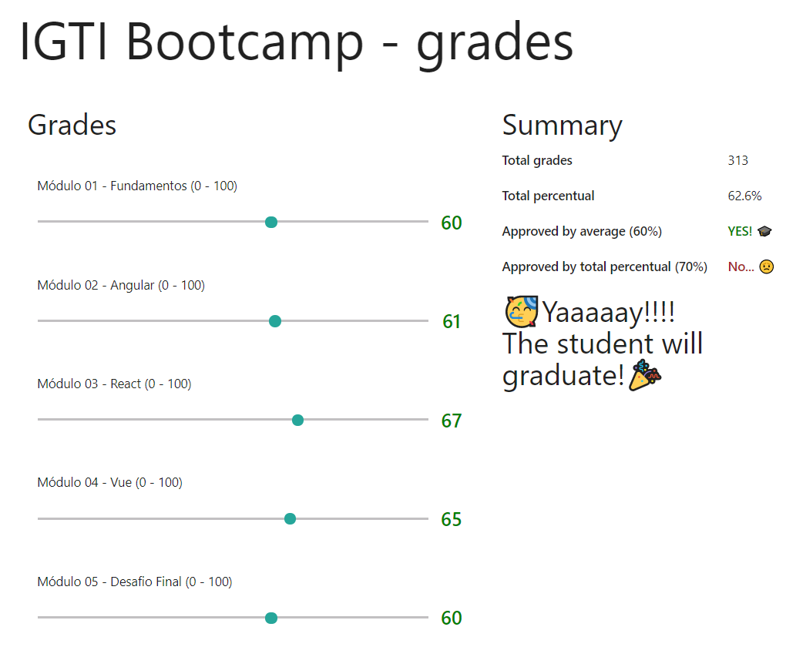

# IGTI - React Bootcamp grades

This project is the result of an assignment from IGTI Front-end Bootcamp - Module 03 - React.

All of the requests could be readed (in portuguese pt-BR) [here](./documents/assignment.pdf).

The main target of this assignment was to verify if the students were able to develop a small project that:
* Is completely developed in React;
* Only uses Class Components (no Hooks);
* Is created using CLI comands;
* Could be dynamically stylized;
* Is able to solve some calculations and render its results;

## Some considerations

This is my very first React project and I already know this is not using all power React can provides. But I've tried my best to keep only using Class Components, as requested.

## Screenshot

